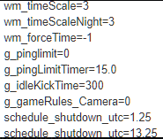

# MisServer-101
Miscreated server setup and configuration guide, put together by 4iY with the help of colleagues from the testing and dev team. 
If you have any questions, you should join the UnOfficial MisModding Discord at this link: https://discord.gg/ttdzgzp
# Setting up a server
   In Miscreated players may host their own servers with their own configurations options which change the balance of the gameplay, or just slight tweaks for something you and your group of friends are not fond of.
   It has to be said that hosting a server is free, and super easy – you may start and run a server on your PC assuming it’s powerful enough *(you would want no less than 12 GBs of RAM and at least 4 actual cores (or 6-8 threads) in your CPU as well as a stable broadband connection to run both the server and the game on the same machine).* Spafbi, one of the game’s testers, has created a simplified script to install and run the server without any bells and whistles, here’s a link to it: https://github.com/Spafbi/simplified-miscreated-server-setup/wiki. Of course, you can look up hosting providers online, but that would not be free – although admittedly largely more stable and reliable than someone’s home PC. I have to note one thing here: the *only* way to have full kiosk access on your server (the ability to deposit and withdraw game items in the kiosk) is to rent a "Central" i3D server, and on that type of server you **cannot** install any mods. Any other provider's or i3D's "Community" package servers will allow modifications to be installed but will not have kiosk access under any circumstances (skins are still available, of course).
   In any case, setting up the server is simple, but configuring it requires quite a bit of expertise. Luckily, you are not the first person to go through this needy process, so this guide will help you wrap your head around it much quicker and easier.

# Actual config
The file that has all the server configuration options is called `hosting.cfg` – here you would put every single option that you want changed over the ‘vanilla’ settings. By the way, here is how vanilla settings look like:



   The automated script by Spafbi will prompt you to input your server’s name and HTTP password *(it is best to use latin letters and numbers without special symbols)*, required to execute commands via RCON to affect the server. You may change them later on in the hosting.cfg file, of course.
   Pretty much everything needed to set the server up is in this link by the developers: https://servers.miscreatedgame.com/help, but this guide will add something on top of that for certain positions. 
   ### NOTICE
   There is one warning that I have to give: if you are putting in a setting in hosting.cfg, it has to be done in this syntax: `command=VALUE`, such as `g_pinglimit=0`, and if the command is being executed via RCON you must avoid the equals sign (=) and replace it with a single space (it'd look like this: `g_pingLimit 0` ). Note: commands executed via RCON are only in effect until the server restarts, it will reset to whatever is in the hosting.cfg or to default on startup. Also, please note that all commands to ban / whitelist are to be done via RCON only!
# Additions to the link above
*How do I add mods to my server?* -It's never been simpler. All you need to do is add this line to your hosting.cfg  `steam_ugc=2238425283,2212323283,2218782283` (yes, as many as you want, separated by a comma with NO spaces). The IDs of desired mods are taken from the URLs of the mods. If you do not see URLs, navigate into your Steam client, in the top-left corner click Steam -> Settings, here find the Interface tab in the list and locate the 'Display URLs where possible' option. Tick it so it's on, then click OK. A typical URL of a mod looks like this: `https://steamcommunity.com/sharedfiles/filedetails/?id=2313425782`, where the `2313425782` is its ID.

During the last few Miscreated updates, some new CVARs have been added, and I figure it's best to add them here.

`ism_percent` - range 0 to 90, the percent of item spawners that can possibly spawn loot - default is 20

`ism_maxCount` - range 0 to 5000, the maximum number of item spawners that can have a spawned item concurrently - default is 750

`as_corpseCountMax` - the maximum number of AI corpses that can exist at once - default is 20

`as_corpseRemovalTime` - the time in seconds until an AI corpse is forcibly removed - default is 300

`g_playerWeightLimit` - the maximum amount of weight a player can carry - default is 40 (kg)

`g_maxHealthMultiplier` - scales the default health for a player - default is 1, don't go beyond 5 - experimental

# Faction system explanation
   Per player request, this guide will also feature a 'better' explanation for the faction system in Miscreated. Please refer to this link: https://servers.miscreatedgame.com/help for the base details.
   
   The faction system in Miscreated is quite flexible - it allows members to join different groups that have pre-defined damage, etc. to and from each other. Let me show you how to build a faction system.

To start with, there are three 'hardcoded' factions that you cannot change - these being 0 (players outside of any faction), 1 (AI - mutants, animals...) and 2 (bases). You can manage damage to and from these three, too. E.g., if you want bases to be unraidable, just add this command to your hosting.cfg: `g_gameRules_faction0_dmg_f2=0.0` . What this does is it makes the damage FROM faction 0 (players) TO faction 2 (bases) 0.0 (none). Using this logic, you can set up damage between the base factions as well as those you define. Let me show you how to make a custom faction, now. I'll go over each line and explain what it does.

```ini
g_gameRules_faction3=1  -- Enable Faction3 

g_gameRules_faction3_name="MyFaction"  -- Faction3's name (player would input `!MyFaction` in chat to join it)

g_gameRules_faction3_dmg_f0=0.0  -- Just for example, Faction3 cannot damage players outside of factions.

[SEE BELOW] g_gameRules_faction3_equip=""
``` 

### Faction Equip management
Factions can also have 'equip' (-ment), items with which anyone inside that factions spawns (after they respawn, of course). This system has nuances to it that not many people know, so I'll delve into them here. 

The line to manage faction equipment, as mentioned above, is g_gameRules_factionX_equip=""  , X being the faction number. By the way, if you put 0 instead of X, all the equipment from that line will adjust items of *all* players outside of any faction (e.g. when first spawning into a server).

The order in which items are put in MATTERS. As an example, if you put `g_gameRules_faction3_equip = "AT15;STANAGx30"`, the magazine will already be in the weapon once you respawn. However, if you switch these around to `"STANAGx30;AT15`, the magazine will go into the first CLOTHING slot available (if none are free or none exist, it wont appear altogether). This also works for clothing items, like so: `"DuffelBagTan;Rags;FannyPackGreen"` *(this will put the Rags into the DuffelBagTan)* and `"FannyPackGreen;9mmx30;DuffelBagTan;Rags"` *(this will also put Rags into the DuffelBagTan and the 9mmx30 into the FannyPackGreen)*. 

Keeping this in mind, you can build fairly diverse systems with different factions for people who want to PvP and those who dont. One notice - you CANNOT leave or join another faction after you've already joined one, unless you have a mod that allows that.

# Conclusion
As you saw, setting up a server is rather simple if you know where to look and what to do. That said, I may have easily overlooked something in this guide, so if you have something to add to it, contact me on Discord ( `-4iY-#4314` ) so I can add / fix it. If you have questions to ask, best ask them publicly in the Discord server I sent above as I am not always around.

# Extras and reference videos
https://www.youtube.com/watch?v=_dG4FuvWQ1Q Using a mod on a dedicated server

